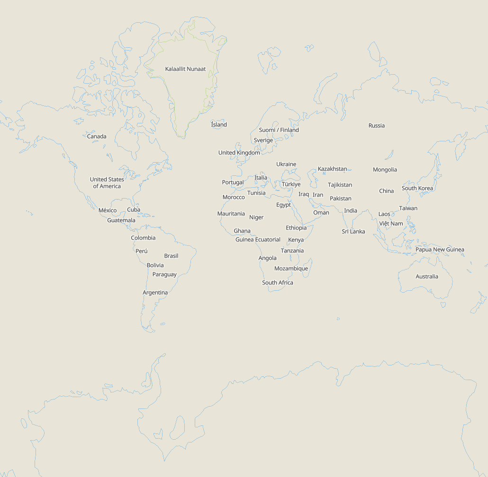

## Prerequisites
1. clone following repositories to start development:
	- [maplibre-style-spec](https://github.com/WetDogWeather/maplibre-style-spec.git)
	- [maplibre-tile-spec](https://github.com/maplibre/maplibre-tile-spec.git)
	- [maplibre-gl-js](https://github.com/Salkin975/maplibre-gl-js)
2. download node version 20.x.x
## Create and serve test data
1. open **maplibre-tile-spec** repository
2. create following directory structure:
maplibre-tile-spec
|-test \
|  |-data \
|  |  |-omt \
|  |  |-optimized \
|  |  |  |-omt \
|  |  |  |  |-mlt \
|  |  |  |  |  |-plain
3. navigate to ./java and follow the instructions in the README → **currently not recomended due to changes to the tile metadata that is not yet supported. example tiles are available in malpibre-gl-js/example_tiles**
    - a guide on how to get and crop mbtiles is here [Create custom map extract](https://openmaptiles.org/docs/generate/create-custom-extract), or download tiles here [maptiler](https://www.maptiler.com/on-prem-datasets/planet/)
    - following commands can be used to create tiles
    - it is recommended to directly generate the tiles in the correct directory:
        maplibre-tile-spec/test/data/optimized/omt/mlt/plain/…
4. in ./ts/package.json change following lines:
	```json
	"typescript": "^5.5.4"
    to
    "typescript": "5.5.4"
	```
5. run following commands in the command line tool:
    - npm install
    - npm link
6. run the following scripts in ./ts/package.json:
    - build
    - bundle
    - serve:data2
## Setup for test Website
1. open the **maplibre-style-spec** repository
2. run following commands in the command line tool of **maplibre-style-spec**:
	```bash
    npm install
    npm link
	```

3. run following commands in the command line tool of **maplibre-gl-js**:
	```bash
	npm install
    npm link "@maplibre/mlt"
	npm link "@maplibre/maplibre-gl-style-spec"
	```
    - this step is buggy, you may ha
## Bugs
- [ ] Polygons aren't rendered correctly


## Todos
- [ ] integrate embedded tile decoder
- [ ] implement other Buckets to have a columnar counterpart
    - [ ] circle
    - [ ] fill_extrusion
    - [ ] heatmap
- [ ] Plain encoded polygon support
- [ ] Support of other geometries in the ColumnarSymbolBucket then points
- [ ] Point, MultiPoint or MultiPolygon geometries are not supported for a LineLayer at zoom 13
- [ ] Fix SymbolLayout to work with both MVT and MLT
- [ ] Extend Style Spec and Worker -> extend validateStyle method in style spec to support mlt
- [ ] Only register buckets once for mvt and mlt bucket
## important places
- columnar buckets are in:
	maplibre-gl-js/src/data/bucket/mlt
- bucket creation is in each coresponding style_layer
- currently used test page: simple-map-test-html


