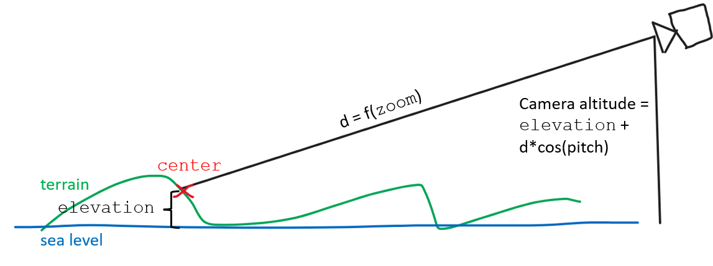
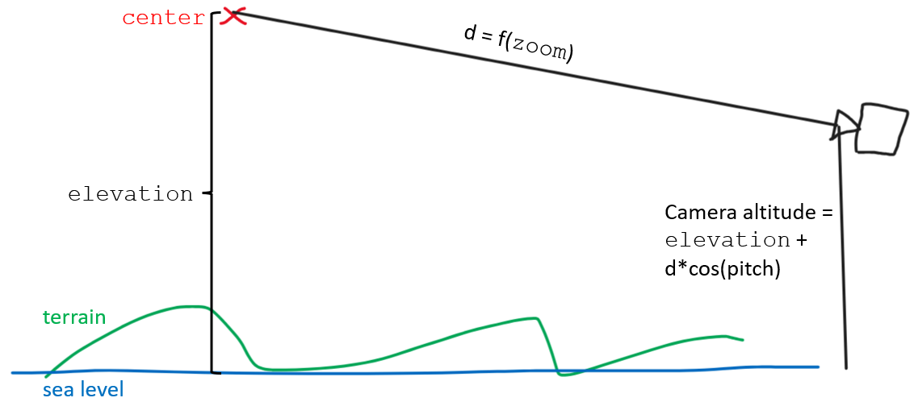
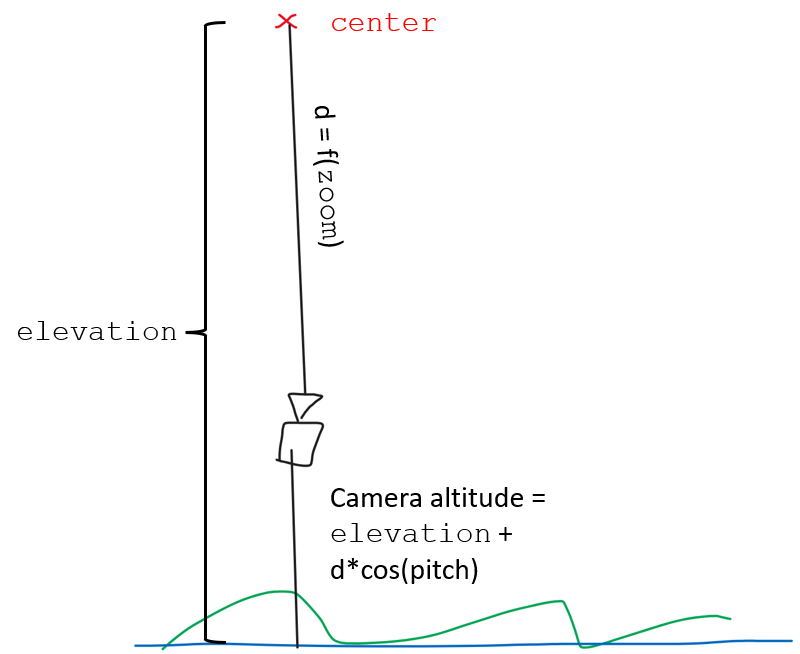
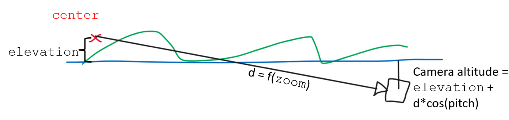

# How Camera position is calculated

This guide describes how camera position is calculated from the center point, zoom, and camera rotation.
The `Transform` variables `center`, `elevation`, `zoom`, `pitch`, `bearing`, and `fov` control the location of the camera indirectly.

 `elevation` sets the height of the "center point" above sea level. In the typical use case (`centerClampedToGround = true`), the library modifies `elevation` in an attempt to keep the center point always on the terrain (or 0 MSL if no terrain is enabled). When `centerClampedToGround = false`, the user provides the elevation of the center point.

`zoom` sets the distance from the center point to the camera (in conjunction with `fovInRadians`, which is currently hardcoded).

Together, `zoom`,  `elevation`, and `pitch` set the altitude of the camera:

See `MercatorTransform::getCameraAltitude()`:
```typescript
    getCameraAltitude(): number {
        const altitude = Math.cos(this.pitchInRadians) * this._cameraToCenterDistance / this._helper._pixelPerMeter;
        return altitude + this.elevation;
    }
```



To allow pitch > 90, the "center point" must be placed off of the ground. This will allow the camera to stay above the ground when it pitches above 90. This requires setting `centerClampedToGround = false`.



The same math applies whether the center point is on terrain or not, and whether the camera is above or below the ground: 





To help users position the camera, `Camera` exports the function `calculateCameraOptionsFromCameraLngLatAltRotation()`.