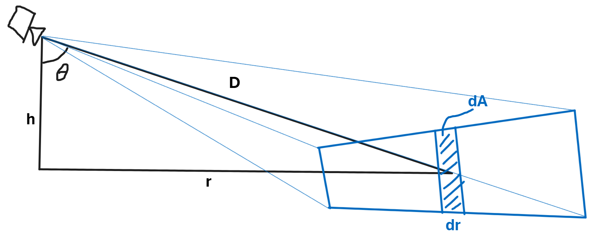

# Covering Tiles calculations
## Terms:

$r$, `distanceToTile2D`, ground range from camera to tile

$D$, `distanceToTile3D`, slant range from camera to tile

$h$, `distanceToTileZ`, camera altitude above tile

$\theta$, `thisTilePitch`, pitch angle from camera to tile

$A$, area (map units)

$Z$, tile zoom level

$S$, tile scale factor (pixels per map unit): $S = 2^Z$

$S_r$, requested center scale factor (pixels per map unit)

$S_c$, center scale factor (pixels per map unit)

subscript $c$, vertical center of screen

$b$, `pitchTileLoadingBehavior`, tile loading tuning parameter 

## Geometry

The distances are related by the equations

$$ r(\theta) = h\tan\theta $$
$$ D(\theta) = h\sec\theta $$

Assume the horizontal field of view is a small angle $\alpha$.

Then the area of an infinitesimal strip on the ground is 

$$ dA = \alpha D dr$$

In tile units, the differential area is

$$ dT = S^2dA =  S^2\alpha D dr = S^2\alpha D \frac{dr}{d\theta}d\theta = S^2\alpha Dh \sec ^2\theta d\theta = S^2\alpha h^2 \sec ^3\theta d\theta = S^2\alpha D_c^2 \cos^2 \theta_c \sec ^3\theta d\theta$$

## Tile scale calculation

The tile scale factor is given by the formula

$$ S = S_c\frac{D_c}{D}\cos^{b/2}\theta = S_c D_c \frac{\cos^{b/2+1}\theta}{h} = S_c \frac{\cos^{b/2+1}\theta}{\cos\theta_c} $$

This formula is arbitrary but has some nice characteristics:

If $S_c = S_r$ and $b = 0$, then $S = S_c\frac{D_c}{D}$, which matches the behavior at `pitch == 0` and causes tiles to be loaded with approximately equal screen width.

If $b = 1$, then tiles are loaded with approximately equal screen area. (This is the default.)

If $b = 2$, then tiles are loaded with approximately equal screen height.

If $b = -1$, then $S = S_c\frac{Dc}{cos\theta_c}$ and all tiles are loaded at the same zoom level. All tiles change zoom level at once.

# `maxZoomLevelsOnScreen`

The number of zoom levels on the screen is
$$N=Z_{max} - Z_{min} + 1 = Z(\theta_{min}) - Z(\theta_{max}) + 1 = \log_2(\frac{S(\theta_{min})}{S(\theta_{max})}) + 1$$

Given the above formula for $S$,

$$ N = \log_2(\frac{\cos^{b/2+1}\theta_{min}}{\cos^{b/2+1}\theta_{max}}) + 1 = \log_2(\frac{\cos\theta_{min}}{\cos\theta_{max}})(b/2+1) + 1$$

$N$ is maximized when $\theta_max$ is at the horizon:

$$ N_{max} = \log_2(\frac{\cos(\theta_{horizon} - vFOV)}{\cos\theta_{horizon}})(b/2+1) + 1$$

Rearranging, $b$ can be written as a function of $N_{max}$:

$$ b = 2(\frac{N_{max} - 1}{\log_2(\frac{\cos(\theta_{horizon} - vFOV)}{\cos\theta_{horizon}})}-1) $$

# `tileCountMaxMinRatio`

Thus the total tile area is 
$$T = \int_{\theta_1}^{\theta2} S_c^2 \frac{\cos^{b+2}\theta}{\cos^2\theta_c}\alpha D_c^2 \cos^2\theta_c \sec ^3\theta d\theta = S_c^2 D_c^2\alpha \int_{\theta_1}^{\theta2} \cos^{b-1}\theta d\theta $$

And the ratio of tile area to tile area at `pitch == 0` is 

$$ \frac{T}{T_0} = \frac{S_c^2 D_c^2\alpha \int_{\theta_1}^{\theta2} \cos^{b-1}\theta d\theta}{S_r^2 D_c^2\alpha \int_{-vFOV/2}^{vFOV/2} \cos^{b-1}\theta d\theta} = \frac{S_c^2}{S_r^2}  \frac{\int_{\theta_1}^{\theta2} \cos^{b-1}\theta d\theta}{\int_{-vFOV/2}^{vFOV/2} \cos^{b-1}\theta d\theta}$$

To set $\frac{T}{T_0}$ to `tileCountMaxMinRatio`,

$$\frac{S_c^2}{S_r^2}  \frac{\int_{\theta_1}^{\theta2} \cos^{b-1}\theta d\theta}{\int_{-vFOV/2}^{vFOV/2} \cos^{b-1}\theta d\theta} = \text{tileCountMaxMinRatio} $$

Thus 

$$S_c = S_r(\text{tileCountMaxMinRatio} \frac{\int_{-vFOV/2}^{vFOV/2} \cos^{b-1}\theta d\theta}{\int_{\theta_1}^{\theta2} \cos^{b-1}\theta d\theta})^{1/2} $$

and

$$Z_c = Z_r+\log_2{(\text{tileCountMaxMinRatio} \frac{\int_{-vFOV/2}^{vFOV/2} \cos^{b-1}\theta d\theta}{\int_{\theta_1}^{\theta2} \cos^{b-1}\theta d\theta})}/2 $$

## The integral

The term $\int_{\theta_1}^{\theta2} \cos^{p}\theta d\theta$ appears twice in the equation for $Z_c$. The solution is

$$\int_{\theta_1}^{\theta2} \cos^{p}\theta d\theta = - \frac{\sin\theta_2}{|\sin\theta_2|}\frac{\cos^{p+1}\theta_2}{p+1} {}_2F_1(\frac{1}{2}, \frac{p+1}{2},\frac{p+3}{2}, \cos^2\theta_2) + \frac{\sin\theta_1}{|\sin\theta_1|}\frac{\cos^{p+1}\theta_1}{p+1} {}_2F_1(\frac{1}{2}, \frac{p+1}{2},\frac{p+3}{2}, \cos^2\theta_1)$$

where ${}_2F_1()$ is the hypergeometric function.