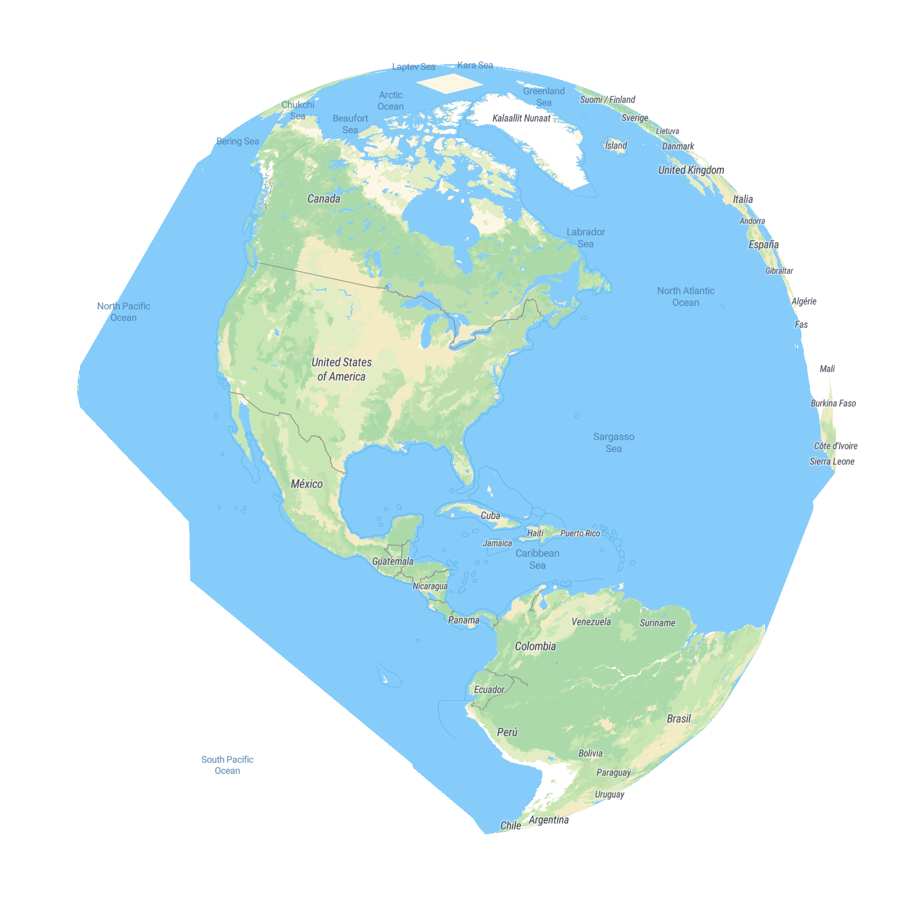
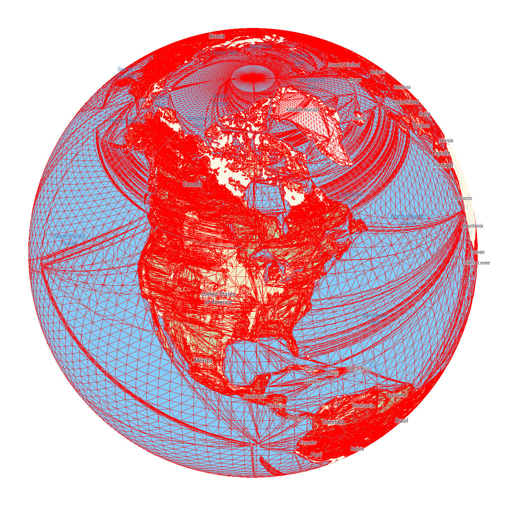
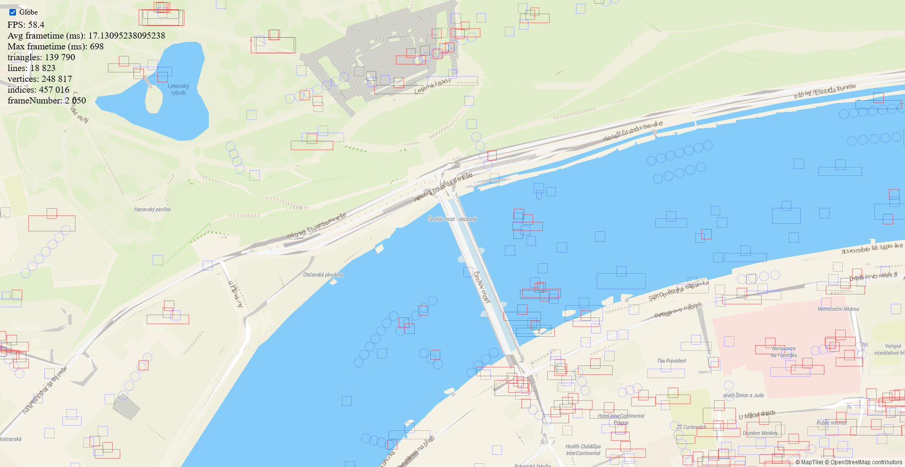

# Globe projection

This guide describes the inner workings of globe projection.
Globe draws the same vector polygons and lines as mercator projection,
ensuring a clear, unstretched image at all view angles and support for dynamic layers and geometry.

The actual projection is done in three steps:

- compute angular spherical coordinates from source web mercator tile data
- convert spherical coordinates to a 3D vector - a point on the surface of a unit sphere
- project the 3D vector using a common perspective projection matrix

So the globe is a unit sphere from the point of view of projection.
This also simplifies a lot of math, and is used extensively in the globe transform class.

Geometry is projected to the sphere in the vertex shader.

## Zoom behavior

To stay consistent with web mercator maps, globe is automatically enlarged when map center is nearing the poles.
This keeps the map center visually similar to a mercator map with the same x,y and zoom.
However, when panning the globe or performing camera animations,
we do not want the planet to get larger or smaller when changing latitudes.
Map movement thus compensates for the planet size change by also
changing zoom level along with latitude changes.

This behavior is completely automatic and transparent to the user.
The only case when the user needs to be aware of this is when
programmatically triggering animations such as `flyTo` and `easeTo`
and using them to both change the map center's latitude and *at the same time*
changing the map's zoom to an amount based on the map's starting zoom.
The example [globe-zoom-planet-size-function](https://maplibre.org/maplibre-gl-js/docs/examples/globe-zoom-planet-size-function/) demonstrates how to
compensate for planet size changes in this case.
All other camera animations (that either specify target zoom
that is not based on current zoom or do not specify zoom at all) will work as expected.

## Shaders

Most vertex shaders use the `projectTile` function, which
accepts a 2D vector of coordinates inside the currently drawn tile,
in range 0..EXTENT (8192), and returns its final projection that can
be directly passed to `gl_Position`.
When drawing a tile, proper uniforms must be set to convert from
these tile-local coordinates to web mercator.

The implementation of `projectTile` is automatically injected into the shader source code.
Different implementations can be injected, depending on the currently active projection.
Thanks to this many shaders use the exact same code for both mercator and globe,
although there are shaders that use `#ifdef GLOBE` for globe-specific code.

## Subdivision

If we were to draw mercator tiles with globe shaders directly, we would end up with a deformed sphere.
This is due to how polygons and lines are triangulated in MapLibre - the earcut algorithm
creates as few triangles as possible, which can sometimes result in huge triangles, for example in the oceans.
This behavior is desirable in mercator maps, but if we were to project the vertices of such large triangles to globe directly,
we would not get curved horizons, lines, etc.
For this reason, before a tile is finished loading, its geometry (both polygons and lines) is further subdivided.

The figure below demonstrates how globe would look without subdivision.
Note the deformed oceans, and the USA-Canada border that is not properly curved.

It is critical that subdivision is as fast as possible, otherwise it would significantly slow down tile loading.
Currently the fastest approach seems to be taking the output geometry from `earcut` and subdividing that further.

When modifying subdivision, beware that it is very prone to subtle errors, resulting in single-pixel seams.
Subdivision should also split the geometry in consistent places,
so that polygons and lines match up correctly when projected.

We use subdivision that results in a square grid, visible in the figure below.

Subdivision is configured in the Projection object.
Subdivision granularity is defined by the base tile granularity and minimal allowed granularity.
The tile for zoom level 0 will have base granularity, tile for zoom 1 will have half that, etc.,
but never less than minimal granularity.

The maximal subdivision granularity of 128 for fill layers is enough to get nicely curved horizons,
while also not generating too much new geometry and not overflowing the 16 bit vertex indices used throughout MapLibre.

Raster tiles in particular need a relative high base granularity, as otherwise they would exhibit
visible warping and deformations when changing zoom levels.

## Floating point precision & transitioning to mercator

Shaders work with 32 bit floating point numbers (64 bit are possible on some platforms, but very slow).
The 23 bits of mantissa and 1 sign bit can represent at most around 16 million values,
but the circumference of the earth is roughly 40 000 km, which works out to
about one float32 value per 2.5 meters, which is insufficient for a map.
Thus if we were to use globe projection at all zoom levels, we would unsurprisingly encounter precision issues.

To combat this, globe projection automatically switches to mercator projection around zoom level 12.
This transition is smooth, animated and can only be noticed if you look very closely,
because globe and mercator projections converge at high zoom levels, and around level 12
they are already very close.

The transition animation is implemented in the shader's projection function,
and is controlled by a "globeness" parameter passed from the transform.

## GPU "atan" error correction

When implementing globe, we noticed that globe projection did not match mercator projection
after the automatic transition described in previous section.
This mismatch was very visible at certain latitudes, the globe map was shifted north/south by hundreds of meters,
but at other latitudes the shift was much smaller. This behavior was also inconsistent - one would
expect the shift to gradually increase or decrease with distance from equator, but that was not the case.

Eventually, we tracked this down to an issue in the projection shader, specifically the `atan` function.
On some GPU vendors, the function is inaccurate in a way that matches the observed projection shifts.

To combat this, every second we draw a 1x1 pixel framebuffer and store the `atan` value
for the current latitude, asynchronously download the pixel's value, compare it with `Math.atan`
reference, and shift the globe projection matrix to compensate.
This approach works, because the error is continuous and doesn't change too quickly with latitude.

This approach also has the advantage that it works regardless of the actual error of the `atan`,
so MapLibre should work fine even if it runs on some new GPU in the future with different
`atan` inaccuracies.

## Clipping

When drawing a planet, we need to somehow clip the geometry that is on its backfacing side.
Since MapLibre uses the Z-buffer for optimizing transparency drawing, filling it with custom
values, we cannot use it for this purpose.

Instead, we compute a plane that intersects the horizons, and for each vertex
we compute the distance from this plane and store it in `gl_Position.z`.
This forces the GPU's clipping hardware to clip geometry beyond the planet's horizon.
This does not affect MapLibre's custom Z values, since they are set later using
`glDepthRange`.

However this approach does not work on some phones due to what is likely a driver bug,
which applies `glDepthRange` and clipping in the wrong order.
So additionally, face culling is used for fill and raster layers
(earcut does not result in consistent winding order, this is ensured during subdivision)
and line layers (which have inconsistent winding order) discard beyond-horizon
pixels in the fragment shader.

## Raster tiles

Drawing raster tiles under globe is somewhat more complex than under mercator,
since under globe they are much more prone to having slight seams between tiles.
Tile are drawn as subdivided meshes instead of simple quads, and the curvature
near the edges can cause seams, especially in cases when two tiles of different
zoom levels are next to each other.

To make sure that there are both no seams and that every pixel is covered by
valid tile texture (as opposed to a stretched border of a neighboring tile),
we first draw all tiles *without* border, marking all drawn pixels in stencil.
Then, we draw all tiles *with* borders, but set stencil to discard all pixels
that were drawn in the first pass.

This ensures that no pixel is drawn twice, and that the stretched borders
are only drawn in regions between tiles. 

## Symbols

Symbol rendering also had to be adapted for globe, as well as collision detection and placement.
MapLibre computed well-fitting bounding boxes even for curved symbols under globe projection
by computing the AABB from a projection of the symbol's box' corners and box edge midpoints.
This is an approximation, but works well in practice. 

## Transformations and unproject

Most projection and unproject functions from the transform interface are adapted for globe,
with some caveats.
The `setLocationAtPoint`function may sometimes not find a valid solution
for the given parameters.
Globe transform currently does not support constraining the map's center.

## Controls

Globe uses slightly different controls than mercator map.
Panning, zooming, etc. is aware of the sphere and should work intuitively,
as well as camera animations such as `flyTo` and `easeTo`.

Specifically, when zooming, the location under the cursor stays under the cursor,
just like it does on a mercator map.
However this behavior has some limitations on the globe.
In some scenarios, such as zooming to the edge of the planet,
this way of zooming would result in rapid and unpleasant map panning.
Thus this behavior is slowly faded out at low zooms and replaced with an approximation.

There are also other edge cases, such as when looking at the planet's poles
and trying to zoom in to a location that is on the other hemisphere ("behind the pole").
MapLibre does not support moving the camera across poles, so instead we need to rotate around.
In this case, an approximation instead of exact zooming is used as well.

Globe controls also use panning inertia, just like mercator.
Special care was taken to keep the movement speed of inertia consistent.
