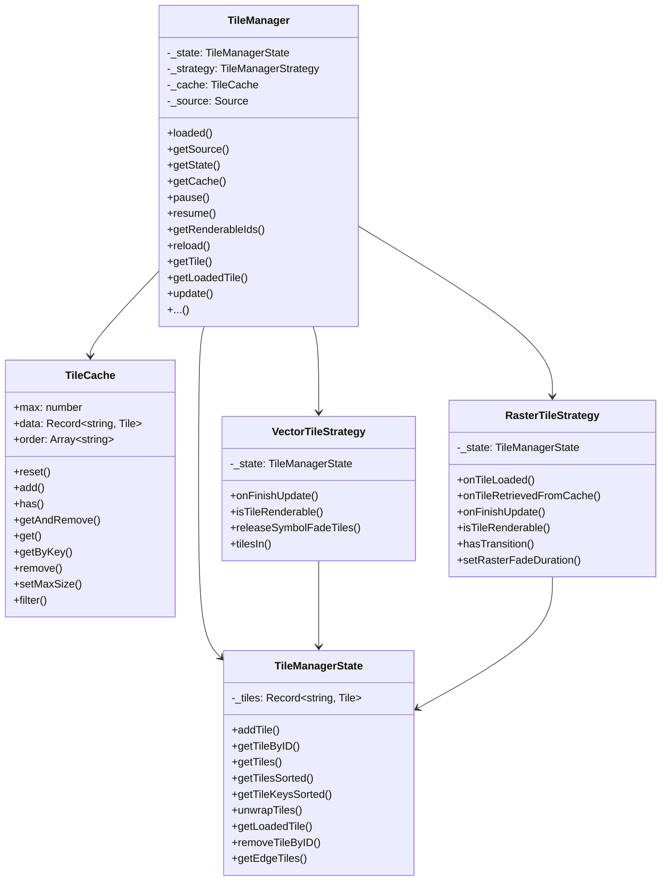

# Tile Manager Architecture

### TileManager
Is the central orchestrator that:
- Coordinates tile loading and lifecycle management
- Maintains active tiles and cached tiles through `TileManagerState` and `TileCache`
- Delegates tile-type-specific behavior to strategy implementations (`VectorTileStrategy` or `RasterTileStrategy`)
- Handles tile expiration, reloading, and feature state management
- Handles tile retainment to display substitute tiles pending the load of ideal tiles.

### TileManagerState
Provides a simple storage layer for active tiles with methods to:
- Add, retrieve, and remove tiles
- Sort tiles for rendering order
- Handle coordinate wrapping when the map pans across the antimeridian
- Return edge tiles in the current tile set

### TileCache
Implements an LRU (Least Recently Used) cache that:
- Stores recently unloaded tiles for quick reuse
- Automatically evicts oldest entries when the cache reaches capacity
- Reduces network requests when panning back to previously viewed areas

### VectorTileStrategy
Handles vector-specific rendering requirements:
- Manages symbol fade animations to prevent label flickering during tile transitions
- Retains tiles with symbols during fade-out periods
- Implements spatial queries for feature picking (`tilesIn`)

### RasterTileStrategy
Manages raster-specific cross-fade effects:
- Orchestrates smooth transitions between parent and child tiles during zoom
- Handles edge tile fading when panning
- Coordinates "many-to-one" fade relationships where multiple tiles fade with a single parent
- Controls fade timing and opacity calculations
