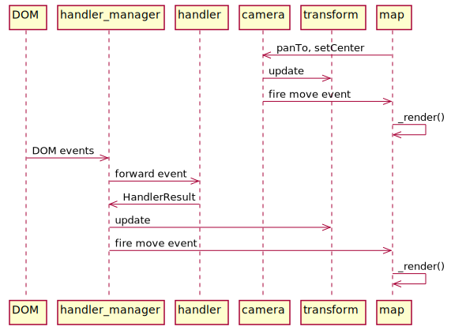
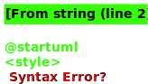

# Life of a Tile

This guide traces through what happens when you load a new tile.

## Event Loop

- [src/geo/transform](../src/geo/transform.js) holds the current viewport details (pitch, zoom, bearing, bounds, etc.). Two places in the code update transform directly:
  - [src/ui/camera](../src/ui/camera.js) (parent class of [src/ui/map](../src/ui/map)) in response to explicit calls to [map#panTo](../src/ui/map.js), [map#setCenter](../src/ui/map.js)
  - [src/ui/handler_manager](../src/ui/handler_manager.js) in response to DOM events. It forwards those events to interaction processors that live in [src/ui/handlers](../src/ui/handlers), which accumulate a merged HandlerResult that kick off a render frame loop, decreasing the inertia and nudging map.transform by that amount on each frame from [\_updateMapTransform()](../src/ui/handler_manager.js#L412). That loop continues in the inertia decreases to 0.
- Both camera and handler_manager are responsible for firing `move`, `zoom`, `movestart`, `moveend`, ... events on the map after they update transform. Each of these events (along with style changes and data load events) triggers a call to [map#\_render()](../src/ui/map.js#L2439) which renders a single frame of the map.

## Loading a tile

[map#\_render()](../src/ui/map.js#L2439) works in 2 different modes based on the value of `map._sourcesDirty`. When `map._sourcesDirty === true`, it starts by asking each source if it needs to load any new data:

- Call [source_cache#update(transform)](../src/source/source_cache.js#L474) on each map data source. This computes the ideal tiles that cover the current viewport and requests missing ones. When a tile is missing, searches child/parent tiles to find the best alternative to show while the ideal tile is loading.
- Call `source#loadTile(tile, callback)` on each source to load the missing tile. Each source implements this differently:
  - [raster_tile_source#loadTile](../src/source/raster_tile_source.js#L112) just kicks off a getImage request using [src/util/ajax](../src/util/ajax.js) which keeps a queue of pending requests and limits the number of in-progress requests. **_TODO different behavior with offscreenCanvas?_**
  - [raster_dem_tile_source#loadTile](../src/source/raster_dem_tile_source.js#L42) starts off the same to fetch the image, but then it sends the bytes in a `loadDEMTile` message to a worker to process before returning the results.
    - [raster_dem_tile_worker_source#loadTile](../src/source/raster_dem_tile_worker_source.js#L25) loads raw rgb data into a [src/data/dem_data](../src/data/dem_data.js) instance. This copies edge pixels out to a 1px border to avoid edge artifacts and passes that back to the main thread **_TODO why does this need to happen in a worker?_**
  - [vector_tile_source#loadTile](../src/source/vector_tile_source.js#L184) sends a `loadTile` or `reloadTile` message to a worker:
    - [worker#loadTile](../src/source/worker.js#L99) handles the message and passes it to [VectorTileWorkerSource#loadTile](../src/source/vector_tile_worker_source.js#L102)
    - Calls [VectorTileWorkerSource#loadVectorTile](../src/source/vector_tile_worker_source.js#L44) which uses
      - [ajax#getArrayBuffer()](../src/util/ajax.js#L261) to fetch raw bytes
      - [pbf](https://github.com/mapbox/pbf) to decode the protobuf, then
      - [@mapbox/vector-tile#VectorTile](https://github.com/mapbox/vector-tile) to parse the vector tile.
      - The result goes into a new [src/source/worker_tile](../src/source/worker_tile.js) instance.
    - Calls [WorkerTile#parse()](../src/source/worker_tile.js#L66) and caches the result in the worker by tile ID:
      - For each vector tile source layer, for each style layer that depends on the source layer that is currently visible ("layer family"):
        - Calculate layout properties (recalculateLayers)
        - Call style.createBucket, which delegates to a bucket type in [src/data/bucket/\*](../src/data/bucket), which are subclasses of [src/data/bucket](../src/data/bucket.js)
        - Call [bucket#populate()](../src/data/bucket.js) with the features from this source layer in the vector tile. This precomputes all the data that the main thread needs to load into the GPU to render each frame (ie. buffers containing vertices of all the triangles that compose the shape)
      - Most layer types just store triangulated features on that first pass, but some layers have data dependencies, so ask the main thread for:
        - Font PBFs (getGlyphs)
          - Handled by [src/render/glyph_manager](../src/render/glyph_manager.js) on the main thread which serves as a global cache for glyphs we’ve retrieved. When one is missing it either uses [tinysdf](https://github.com/mapbox/tiny-sdf) to render the character on a canvas, or makes a network request to load the font PBF file for the range that contains the missing glyphs.
        - Icons and patterns (getImages({type: 'icon' | 'pattern' }))
          - Handled by [src/render/image_manager.js](../src/render/image_manager.js) on the main thread which caches images we’ve already fetched and fetches them if missing
    - When all data dependencies are available [WorkerTile.js#maybePrepare()](../src/source/worker_tile.js#L178), create a new [GlyphAtlas](../src/render/glyph_atlas.js) and [ImageAtlas](../src/render/image_atlas.js) that store the used font glyph symbols and icon/pattern images into a square matrix that can be loaded into the GPU using [potpack](https://github.com/mapbox/potpack). Then call [StyleLayer#recalculate()](../src/style/style_layer.js#L198) on each layer that was waiting for a data dependency and:
      - Call `addFeatures` on each bucket waiting for a pattern
      - Call [src/symbol/symbol_layout#performSymbolLayout()](../src/symbol/symbol_layout.js#L150) for each bucket waiting for symbols, which computes text layout properties for the zoom level and places each individual symbol based on character shapes and font layout parameters, and stores the triangulated symbol geometries. Also computes collision boxes that will be used to determine which labels to show to avoid collisions
    - Pass the buckets, featureIndex, collision boxes, glyphAtlasImage, and imageAtlas back to the main thread
  - [GeojsonSource#loadTile()](../src/source/geojson_source.js) also sends a loadTile or reloadTile message to a worker. The handling is almost exactly the same as a vector tile, except [GeojsonWorkerSource](../src/source/geojson_worker_source.js) extends [VectorTileWorkerSource](../src/source/vector_tile_worker_source.js) and overrides `loadVectorData` so that instead of making a network request and parsing the PBF, it loads the initial geojson data into [geojson-vt](https://github.com/mapbox/geojson-vt) and calls the [getTile](https://github.com/mapbox/geojson-vt/blob/35f4ad75feed64e80ff2cd02994976c6335859cd/src/index.js#L161) method to get vector tile data from the geojson for each tile the main thread needs.
  - [ImageSource#loadTile()](./source/source/image_source.js#L246) computes the most-zoomed-in tile that contains the entire bounds of the image being rendered and only returns success if the main thread is requesting that tile (the image was already requested when layer was added to the map)
- When the vector sources (geojson/vector tile) responses get back to the main thread, it calls [Tile#loadVectorData](../src/source/tile.js#L140) with the result which deserializes and stores the buckets for each style layer, image/glyph atlases, and lazy-loads the RTL text plugin if this is the first tile to contain RTL text.
- Back up in [SourceCache](../src/source/source/source_cache.js), now that it has the loaded tile:
  - [SourceCache#\_backfillDEM](../src/source/source_cache.js#L274) copies the edge pixels to and from all neighboring tiles so that there are no rendering artifacts when each tile computes the slope up to the very edge of the tile.
  - Fire a `data {dataType: 'source'}` event on the source, which bubbles up to [SourceCache](../src/source/source_cache.js), [Style](../src/style/style.js), and [Map](../src/ui/map.js), which translates it to a `sourcedata` event and also calls [Map#\_update()](../src/ui/map.js#L2402) which calls [Map#triggerRepaint()](../src/ui/map.js#L2624) then [Map#\_render()](../src/ui/map.js#L2439) which renders a new frame just like when user interaction triggers transform change.

## Rendering a frame

When `map._sourcesDirty === false`, [map#\_render()](../src/ui/map.js#L2439) just renders a new frame entirely within the main UI thread:

- Recompute "paint properties" based on the current zoom and current transition status by calling [style#update()](../src/style/style.js) with the new transform. This calls `recalculate()` on each style layer to compute the new paint properties.
- Fetch new tiles by calling [source_cache#update(transform)](../src/source/source_cache.js#L474) (see above)
- Call [Painter#render(style)](../src/render/painter.js#L357) with the current style
  - Calls [source_cache#prepare(context)](../src/source/source_cache.js#L169) on each source
  - Then for each tile in the source:
    - Call [Tile#upload(context)](../src/source/tile.js#L241) which uploads
    - Call [Tile#prepare(imageManager)](../src/source/tile.js#L261) uploads image textures (patterns, icons) for this tile to the GPU.
  - Make 3 passes over each layer, calling `renderLayer()` on the [src/render/draw\_\*](../src/render) file for each kind of layer:
    - `offscreen` pass uses the GPU to precompute and cache data to an offscreen framebuffer for custom, hillshading, and heatmap layers. Hillshading precomputes slope using the GPU and heatmap
    - `opaque` pass renders fill and background layers with no opacity from top to bottom
    - `translucent` pass renders each other layer from bottom to top
    - `debug` pass renders debug collision boxes, tile boundaries, etc. on top
  - Each `renderLayer()` call loops through each visible tile to paint and for each binds textures, and uses a vertex and attribute shader program defined in [src/shaders](../src/shaders) and calls [Program#draw()](../src/render/program.js#L123) which sets GPU configuration for the program, sets uniforms needed by the program and calls `gl.drawElements()` which actually renders the layer on the screen for that tile.
- Finally, trigger another repaint if there is any more rendering to do. Otherwise trigger an `idle` event because the map is done loading.
