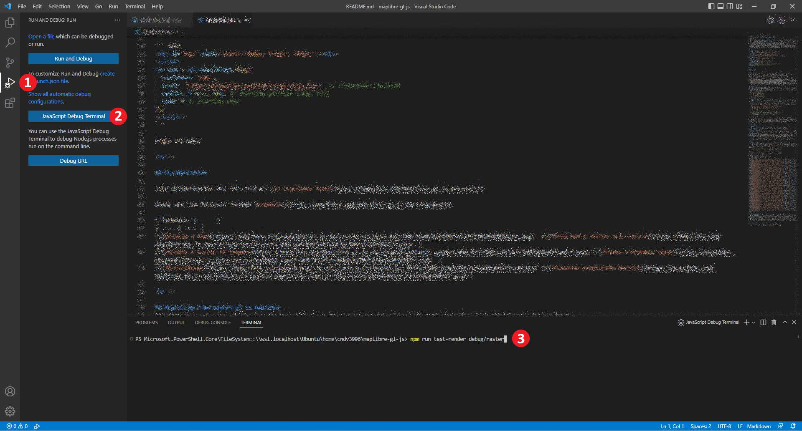

# Tests

## Running Tests

First you must configure your development environment per [`../CONTRIBUTING.md`](../CONTRIBUTING.md)

To run individual tests:

 - Unit tests: `npx jest path/to/file.test.js` (e.g. `npx jest src/style/style_layer.test.ts`)
 - Render tests: `npm run test-render -- render-test-name` (e.g. `npm run test-render -- text-rotation-alignment`)

To run folders in watch mode, meaning they will run continuously as you make changes to relevant code, (i.e. for test driven development): use `npm run test-watch-roots *folder1* [*folder2*...]` (e.g. `npm run test-watch-roots ./src/ui/control`)

 ## Debugging Tests on Windows

Steps to use Visual Studio Code:

 - Install VS Code.
 - Open MapLibre root folder with VS Code UI.
 - Start debugging:
 
   
   Before debugging, you might want to set break points in sources.

## Integration Tests

See [`test/integration/README.md`](./integration/README.md).

## Writing Unit Tests

 - **You must not share variables between test cases.** All test fixtures must be wrapped in `create` functions. This ensures each test is run in an isolated environment.
 - **You should not mock any internal domain objects.** Internal domain objects include `Style`, `Map`, `Transform`, and `Dispatcher`. If this is difficult because of some interface, refactor that interface. This ensures that tests accurately exercise the code paths used in production.
 - **You should test one return value or side effect per test case.** Feel free to pull shared logic into a function. This ensures that tests are easy to understand and modify.
 - **You should only test the return values and global side effects of methods.** You should not not test internal behavior, such as that another method is called with particular arguments. This ensures that method implementations may change without causing test failures.
 - **You must not make network requests in test cases.** This rule holds in cases when result isn't used or is expected to fail. You may use `window.useFakeXMLHttpRequest` and `window.server` per the [Sinon API](http://sinonjs.org/docs/#server) to simulate network requests. This ensures that tests are reliable, able to be run in an isolated environment, and performant.
 - **You should use clear [input space partitioning](http://crystal.uta.edu/~ylei/cse4321/data/isp.pdf) schemes.** Look for edge cases! This ensures that tests suites are comprehensive and easy to understand.
 - Before submit or modify tests, suggest to run the tests and verify your results on both Windows and Linux CI (e.g. WSL).

## Spies, Stubs, and Mocks

The test object is augmented with methods from Sinon.js for [spies](http://sinonjs.org/docs/#spies), [stubs](http://sinonjs.org/docs/#stubs), and [mocks](http://sinonjs.org/docs/#mocks). For example, to use Sinon's spy API, call `t.spy(...)` within a test.

The test framework is set up such that spies, stubs, and mocks on global objects are restored at the end of each test.
