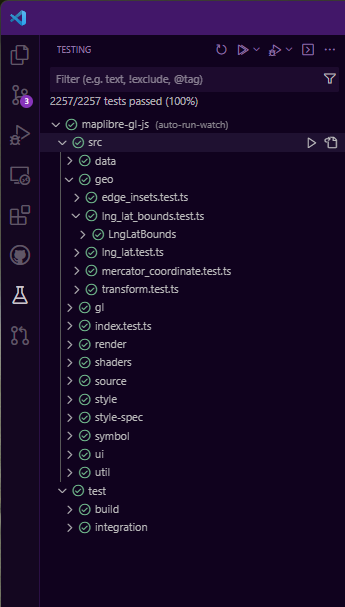

# Tests

Tests should automatically be run on every PR via Github CI, but it's recommended to also run them locally.

## Running Tests

First you must configure your development environment per [`../CONTRIBUTING.md`](../CONTRIBUTING.md)

Then run:

```
npm test
```

Note that for Linux you'll need to prefix test commands with `xvfb-run -a` for example `xvfb-run -a npm run test`.
Note that some tests rely on the built project and will not pass until you have run `npm run build-dist`.
The render tests rely on the dev-build of the project, and they will not pass until you have run `npm run build-dev`. Don't forget to run it after changing your code as well.

To run specific tests:

 - Unit test by file name : `npx jest path/to/file.test.ts --reporters=default` (e.g. `npx jest src/style/style_layer.test.ts`)
 - Unit test that matches a test name: `npx jest path/to/file.test.ts --reporters=default -t "test name"`
 - Browser test that matches a test name: `npx jest test/integration/browser/browser.test.ts --reporters=default -t "test name"`, in some cases here you might want to change the headless mode in the test file to be `false` to see what's happening in the browser.
 - Render tests that matches a folder or file names: `npm run test-render -- render-test-name` (e.g. `npm run test-render -- text-rotation-alignment`)

To run folders in watch mode, meaning they will run continuously as you make changes to relevant code, (i.e. for test driven development): use `npm run test-watch-roots *folder1* [*folder2*...]` (e.g. `npm run test-watch-roots ./src/ui/control`)

## Debugging Tests in VSCode

Steps to use Visual Studio Code:

 - Install VS Code.
 - Open MapLibre root folder with VS Code UI.
 - Start debugging:

   
   Before debugging, you might want to set break points in sources.

You may also run tests and view output with the plugin [orta.vscode-jest](https://marketplace.visualstudio.com/items?itemName=Orta.vscode-jest):



If you do so, note that the initial test run may take a while (3 minutes or so), during which time the test results are not yet available.

## Integration Tests

See [`test/integration/README.md`](./integration/README.md).

## Writing Unit Tests

 - **You must not share variables between test cases.** All test fixtures must be wrapped in `create` functions. This ensures each test is run in an isolated environment.
 - **You should not mock any internal domain objects.** Internal domain objects include `Style`, `Map`, `Transform`, and `Dispatcher`. If this is difficult because of some interface, refactor that interface. This ensures that tests accurately exercise the code paths used in production.
 - **You should test one return value or side effect per test case.** Feel free to pull shared logic into a function. This ensures that tests are easy to understand and modify.
 - **You should only test the return values and global side effects of methods.** You should not not test internal behavior, such as that another method is called with particular arguments. This ensures that method implementations may change without causing test failures.
 - **You must not make network requests in test cases.** This rule holds in cases when result isn't used or is expected to fail. You may use `fakeServer.create()` per the [nise (Sinon) API](https://sinonjs.github.io/nise/#fake-server) to simulate network requests. This ensures that tests are reliable, able to be run in an isolated environment, and performant.
 - **You should use clear [input space partitioning](https://crystal.uta.edu/~ylei/cse4321/data/isp.pdf) schemes.** Look for edge cases! This ensures that tests suites are comprehensive and easy to understand.
 - Before submit or modify tests, suggest to run the tests and verify your results on both Windows and Linux CI (e.g. WSL).

## Spies, Stubs, and Mocks

The test object is augmented with methods from Sinon.js for [spies](https://sinonjs.org/docs/#spies), [stubs](https://sinonjs.org/docs/#stubs), and [mocks](https://sinonjs.org/docs/#mocks). For example, to use Sinon's spy API, call `t.spy(...)` within a test.

The test framework is set up such that spies, stubs, and mocks on global objects are restored at the end of each test.
